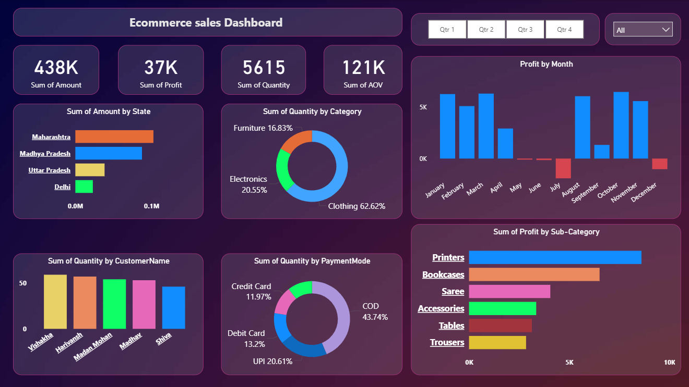

# Ecommerce Sales Analytics Dashboard (Power BI)

## Project Overview
This project presents an **Ecommerce Sales Analytics Dashboard** built using **Power BI**. The dashboard analyzes sales data from an online store to uncover insights about revenue, profit, product categories, payment methods, and customer purchasing behavior.

The goal of this project is to transform raw ecommerce data into **interactive visual insights** that support better business decisions and performance monitoring.

---

## Dashboard Preview

---

## Key Performance Indicators

- **Total Sales Amount:** 438K  
- **Total Profit:** 37K  
- **Total Quantity Sold:** 5615  
- **Average Order Value (AOV):** 121K  

These KPIs provide a quick overview of the business performance.

---

## Dashboard Features

### Sales Performance
- Sales distribution by **state**
- Monthly **profit trends**
- Category-wise **sales distribution**

### Product Insights
- Profit by **sub-category**
- Quantity sold by **product category**

### Customer Insights
- Quantity purchased by **customer**

### Payment Analysis
- Payment method distribution:
  - COD
  - UPI
  - Debit Card
  - Credit Card

### Interactive Filters
Users can filter the dashboard using:
- **Quarter filters**
- **Category filters**

---

## Tools & Technologies Used

- **Power BI** – Data visualization and dashboard creation
- **Power Query** – Data cleaning and transformation
- **DAX (Data Analysis Expressions)** – Measures and calculated columns
- **Excel / CSV Dataset** – Source data

---

## Key Insights

- **Clothing category** contributes the highest sales share.
- **Printers and Bookcases** generate strong profits among sub-categories.
- **COD** is the most frequently used payment method.
- Certain states contribute significantly higher revenue than others.
- Profit fluctuates across months, indicating seasonal trends.

---

---

## How to Use

1. Clone or download the repository.
2. Open the `.pbix` file in **Power BI Desktop**.
3. Interact with the dashboard using filters.
4. Explore sales, profit, and customer insights.

---

## Future Improvements

- Add **sales forecasting using Power BI**
- Integrate **customer segmentation analysis**
- Include **regional performance comparison**
- Add **year-over-year sales growth analysis**

---

## Author
This project was created as part of learning **data analytics and business intelligence using Power BI**.
